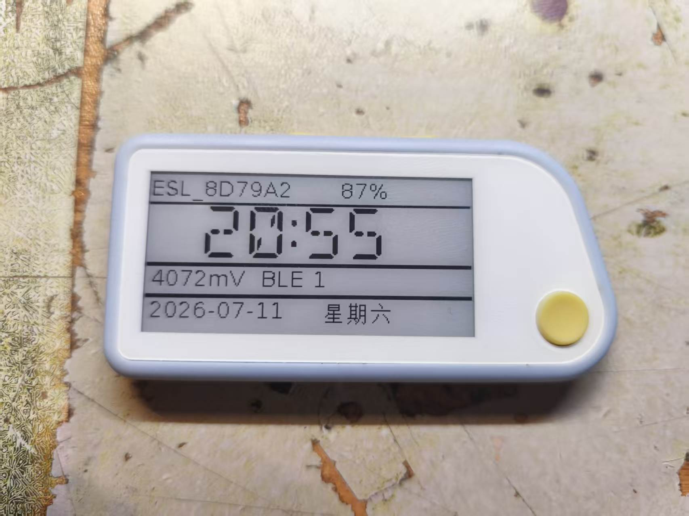
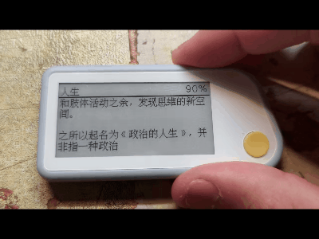

<h1 align="center">📖 MiaoPaper</h1>

<p align="center">
  <strong>喵喵机 Paperang E1 开源电子书固件</strong><br>
  把 2.13 寸墨水屏变成随身阅读器 · 蓝牙传书 · 低功耗待机
</p>

<p align="center">
  
  
  
  
  
</p>

<p align="center">
  <a href="#-功能特性">功能</a> ·
  <a href="#-效果预览">预览</a> ·
  <a href="#-快速开始">快速开始</a> ·
  <a href="#-按钮操作">按钮</a> ·
  <a href="#-网页与工具">工具</a> ·
  <a href="#-编译">编译</a> ·
  <a href="#-致谢">致谢</a>
</p>

---

## ✨ 功能特性

| 功能 | 说明 |
|:-----|:-----|
| 📚 **电子书阅读** | 支持 TXT 文本，GB2312 / ASCII 编码，最多 8 本书，进度保存 |
| 🔤 **中文字库** | 16×16 点阵字库，蓝牙 OTA 上传 |
| 🕐 **时钟待机** | 多种时钟样式，分钟级局部刷新 |
| 💾 **断点续读** | 阅读进度写入外置 Flash，重启不丢失 |
| 🔒 **锁屏省电** | 超时自动锁屏，按键唤醒，深度休眠 |
| 📡 **蓝牙管理** | Web 传书、传字库、OTA 升级； |
| ⚙️ **设置菜单** | 休眠超时、BLE 开关、局刷策略等可配置 |

---

## 📸 效果预览

> 请将截图放入 `docs/images/` 后替换下方路径

<p align="center">
  
  &nbsp;&nbsp;
  
</p>


<p align="center">
  
</p>

---

## 🚀 快速开始

### 1. 刷入固件

**方式 A — UART 线刷（首次）**

1. 拆开 E1 后盖，确认主控为 **TLSR8258** 系列
2. 焊接 GND / VCC / RX / RTS 四根线，接 USB-TTL（CH340）
3. 打开 [UART 刷机工具](web_tools/uart_flasher.html) 或 [ATC 通用工具](https://atc1441.github.io/ATC_TLSR_Paper_UART_Flasher.html)
4. 波特率 `460800`，选择 `Firmware/MiaoPaper.bin`
5. 先点 **Unlock**，再点 **Write to Flash**

**方式 B — 蓝牙 OTA（已有旧版固件时）**

打开 [MiaoPaper.html](MiaoPaper.html) 或 [MiaoPaper_OTA.html](MiaoPaper_OTA.html)，连接 `MPP_XXXXXX` 后上传 `.bin` 固件。

### 2. 上传字库（首次必做）

网页工具 → **上传字库** → 选择 `HZK16_87.bin`  
状态栏显示 `✔ 字库已安装` 即可。

### 3. 上传书籍

网页工具 → **上传书籍** → 选择 `.txt` 文件

- 编码：中文书选 **GB2312**，英文选 **ASCII**，请确保 txt 文件本身为 GB 编码
- 上传后点 **刷新列表** 确认

### 4. 开始阅读

设备在时钟界面 → **长按右键 ~1 秒** → 选书 → **短按前键** 确认打开

### Windows 上传加速

Chrome 网页 MTU 固定 20 字节，大文件上传较慢。推荐使用 Python 工具：

```powershell
pip install -r web_tools/requirements-upload.txt
python web_tools/mpp_upload.py scan
python web_tools/mpp_upload.py book 书.txt -a MAC地址 -t "书名"
```

---

## 🎮 按钮操作

| 界面 | 操作 | 效果 |
|:-----|:-----|:-----|
| 时钟 | 长按右键 | 进入选书菜单 |
| 时钟 | 长按左键 | 进入设置 |
| 选书 | 短按左/右键 | 移动光标 |
| 选书 | 短按前键 | 确认打开 |
| 选书 | 长按右键 | 返回时钟 |
| 阅读 | 短按右键 / 前键 | 下一页 |
| 阅读 | 短按左键 | 上一页 |
| 阅读 | 长按右键 | 保存进度并退出 |
| 任意 | 长按前键 | 锁屏 / 唤醒 |

> 按钮事件基于 [LwBTN](https://github.com/MaJerle/lwbtn) 库实现，支持单击、长按、防抖。

---

## 🌐 网页与工具

| 工具 | 链接 | 用途 |
|:-----|:-----|:-----|
| 📡 蓝牙控制台 | [MiaoPaper.html](MiaoPaper.html) · [GitHub Pages](https://hrp518.github.io/MiaoPaper/) | 传书、传字库、设置、调试 |
| 🔄 固件 OTA | [MiaoPaper_OTA.html](MiaoPaper_OTA.html) | 蓝牙固件升级 |
| ⚡ 快速上传 | [mpp_upload.py](web_tools/mpp_upload.py) | Windows/Linux 命令行传书（bleak） |
| 🔧 UART 刷机 | [uart_flasher.html](web_tools/uart_flasher.html) · [ATC 工具](https://atc1441.github.io/ATC_TLSR_Paper_UART_Flasher.html) | WebSerial 线刷固件 |

蓝牙广播名：**`MPP_` + MAC 后三字节**（如 `MPP_A1B2C3`）

本地运行网页工具：

```bash
cd web_tools && python -m http.server 8000
# 浏览器打开 http://127.0.0.1:8000
```

> 需要 Chrome / Edge 等支持 Web Bluetooth 的浏览器。

---

## 🔧 编译

Windows（需 Telink TC32 工具链，仓库已含 `tc32_windows`）：

```bat
cd Firmware
makeit_build.bat
```

产物：`Firmware/MiaoPaper.bin`（含 CRC32 尾缀）

---

## 📋 硬件信息

| 项目 | 规格 |
|:-----|:-----|
| 主控 | Telink TLSR8258 |
| 屏幕 | 2.13" 墨水屏，SSD1680，250×122 像素 |
| 存储 | 外置 SPI Flash（存书 + 字库） |
| 连接 | BLE 4.x |
| 按键 | 前 / 左 / 右 三键 |

---

## 📁 仓库结构

```
MiaoPaper/
├── Firmware/           # TLSR8258 固件源码
├── MiaoPaper.html      # Web 蓝牙控制台
├── MiaoPaper_OTA.html  # OTA 页面
├── web_tools/          # 辅助网页与 Python 工具
├── docs/images/        # README 截图（自行添加）
└── README.md
```

---

## 🙏 致谢

本项目站在巨人肩膀上，特别感谢：

| 项目 | 作者 | 贡献 |
|:-----|:-----|:-----|
| [ATC_TLSR_Paper](https://github.com/atc1441/ATC_TLSR_Paper) | [atc1441](https://github.com/atc1441) | TLSR 墨水屏固件基础、EPD 驱动、BLE 协议 |
| [stellar-L3N-etag](https://github.com/javabin-cn/stellar-L3N-etag) | [javabin-cn](https://github.com/javabin-cn) | 电子价签固件二次开发参考 |
| [ATC_MiThermometer](https://pvvx.github.io/ATC_MiThermometer/) | [pvvx](https://github.com/pvvx) | Web 工具 UI 设计参考 |
| [LwBTN](https://github.com/MaJerle/lwbtn) | [MaJerle](https://github.com/MaJerle) | 轻量按钮事件库（单击 / 长按 / 防抖） |
| [TLSRPGM](https://github.com/pvvx/TLSRPGM) | [pvvx](https://github.com/pvvx) | SWire 刷机工具 |
| [OneBitDisplay](https://github.com/bitbank2/OneBitDisplay) | Larry Bank | 1-bit 图形渲染 |
| Telink Kite BLE SDK | Telink | 蓝牙协议栈 |

---

## 📄 许可

MIT License — 详见 [LICENSE](LICENSE)

---

<p align="center">
  <strong>hrp</strong> ·
  <a href="https://github.com/hrp518">GitHub</a> ·
  <a href="https://space.bilibili.com/hrp8888">Bilibili</a> ·
  hrp8888@outlook.com
</p>
